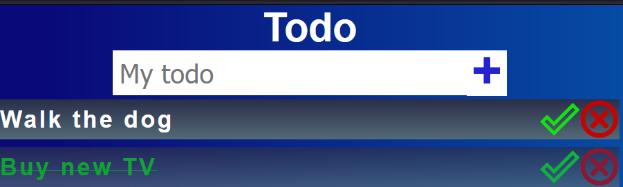

# Taskista

## Table of contents

- [Overview](#overview)
- [Installation](#installation)
- [Features](#features)
- [Screenshots](#screenshots)
- [Technologies](#technologies)

## Overview

This is a simple todo application built using React.js to help you track daily tasks. It allows users to add, delete, and mark tasks as completed.

## Installation

Navigate to the project directory:

```bash
  cd Taskista
```

Install dependencies using npm:

```bash
  npm install
```

Start the development server:

```bash
  npm start
```

Open your browser and visit http://localhost:3000 to view the application.

## Features

- Add new tasks to the list.
- Mark tasks as completed.
- Delete tasks from the list.

## Screenshots

<br>

## Technologies

- React.js  
- JavaScript  
- HTML5  
- CSS3  
